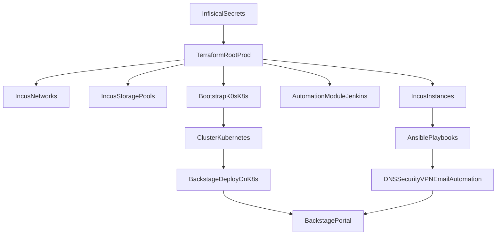

# Roadmap de aprendizaje — infraestructura vcsoft-infra

Ruta sugerida para pasar de **conceptos generales** a **trabajar con seguridad** sobre este repositorio. Cada fase incluye enlaces al repo y recursos externos típicos (documentación oficial).

---

## Fase 1 — Fundamentos de sistema y red

**Objetivo:** moverte por servidores Linux y entender conectividad antes de tocar Terraform o Ansible.

| Tema | Qué dominar | Ancla en el repo |
|------|-------------|------------------|
| Shell y servicios | systemd, logs (`journalctl`), usuarios, sudo | Cualquier host gestionado por Ansible |
| SSH | claves, `~/.ssh/config`, bastion si aplica | `group_vars/all.yml` (sin abrir secretos) |
| Redes | IPv4, subredes, DNS, NAT, rutas | [04-incus-y-red.md](04-incus-y-red.md), `networks.tf` |
| YAML | sintaxis, listas, mapas | Playbooks y `helm/jenkins/values.yaml` |

**Recursos:** documentación de tu distribución Linux; [YAML spec](https://yaml.org/spec/) (referencia breve).

---

## Fase 2 — Infraestructura como código (Terraform)

**Objetivo:** leer y razonar sobre `plan`/`apply`, estado remoto y módulos.

| Tema | Qué dominar | Ancla en el repo |
|------|-------------|------------------|
| HCL | recursos, variables, outputs, módulos | `infra/environments/prod/*.tf`, `00-setup-terraform/*.tf` |
| Terraform Cloud | workspaces, variables sensibles, ejecuciones remotas | [03-terraform-stacks.md](03-terraform-stacks.md) |
| Providers | bloques `provider`, versiones en `required_providers` | `providers.tf` en cada stack |

**Recursos:** [Terraform docs](https://developer.hashicorp.com/terraform/docs); [Provider Incus](https://registry.terraform.io/providers/lxc/incus/latest/docs); [Provider Infisical](https://registry.terraform.io/providers/Infisical/infisical/latest/docs).

---

## Fase 3 — Contenedores, LXC y Kubernetes

**Objetivo:** distinguir máquina virtual, contenedor LXC y Pod de Kubernetes; entender exposición de servicios.

| Tema | Qué dominar | Ancla en el repo |
|------|-------------|------------------|
| LXC vs Docker | nesting, perfiles de recurso | `instances.tf` (`extra_config`) |
| Kubernetes | Pods, Deployments, Services, Ingress, namespaces, RBAC | `backstage.tf` |
| Helm | charts, values, releases | `main.tf` (Helm), `automation.tf` (Jenkins) |
| Load balancing en bare metal | MetalLB, IP pools (concepto) | Comentarios en `00-setup-terraform/main.tf` |

**Recursos:** [Kubernetes concepts](https://kubernetes.io/docs/concepts/); [Helm](https://helm.sh/docs/); [k0s](https://docs.k0sproject.io/docs/); [MetalLB](https://metallb.io/).

---

## Fase 4 — Stack concreto de la empresa

**Objetivo:** recorrer el árbol sin perderte entre los dos workspaces.

| Orden | Acción |
|-------|--------|
| 1 | Leer [02-mapa-del-repositorio.md](02-mapa-del-repositorio.md) | 
| 2 | Trazar `Infra-interna`: `infisical.tf` → `networks.tf` / `storage_pools.tf` → `instances.tf` |
| 3 | Trazar `VCSOFT-Interno`: `k0sctl_config` → Helm → manifiestos Backstage |
| 4 | Abrir `modules/*/README.md` generados por terraform-docs |

---

## Fase 5 — Ansible

**Objetivo:** ejecutar y extender playbooks con inventario y roles.

| Tema | Qué dominar | Ancla en el repo |
|------|-------------|------------------|
| Inventario | grupos, hosts, variables | `ansible/inventory/production/hosts.yml` |
| Playbooks y roles | includes, handlers, templates | `ansible/playbooks/`, `ansible_collections/vcsoft/infra/` |
| Vault | cifrado de secretos en repo | `group_vars/all.yml` |
| Collections | Galaxy, namespaces | `requirements.yml` |

**Recursos:** [Ansible docs](https://docs.ansible.com/).

---

## Fase 6 — Gestión de secretos (Infisical y prácticas)

**Objetivo:** flujo de identidades de máquina y secretos en Terraform sin filtrar credenciales.

| Tema | Qué dominar | Ancla en el repo |
|------|-------------|------------------|
| Carpetas y entornos en Infisical | alineación con `infisical.tf` | [05-secretos-infisical.md](05-secretos-infisical.md) |
| Variables sensibles en Terraform Cloud | no commitear `.tfvars` con secretos | Workspaces `Infra-interna` / `VCSOFT-Interno` |

**Recursos:** documentación de Infisical en el sitio del proveedor; políticas internas de seguridad VCSOFT.

---

## Fase 7 — Plataforma de desarrolladores (Backstage)

**Objetivo:** entender entidades, catálogo y relación con Kubernetes.

| Tema | Qué dominar | Ancla en el repo |
|------|-------------|------------------|
| Modelo Backstage | System, Component, APIs | `catalog-info.yaml` (raíz), `backstage/backstage-vcsoft/catalog-info.yaml` |
| app-config | integraciones y auth | `backstage/backstage-vcsoft/app-config.yaml` |
| Despliegue | imagen vs código fuente | [06-kubernetes-y-plataforma.md](06-kubernetes-y-plataforma.md) |

**Recursos:** [Backstage docs](https://backstage.io/docs/).

---

## Fase 8 — Seguridad y observabilidad (según el repo)

**Objetivo:** conectar playbooks con herramientas reales desplegadas.

| Tema | Qué dominar | Ancla en el repo |
|------|-------------|------------------|
| Agente Wazuh | instalación por rol | `wazuh_agent` en colección `vcsoft.infra` |
| VPN | gateway, integración Tailscale/Headscale | `vpn_gateway`, `vc_vpn.yml` |
| Backups | rclone, rotación | `backup`, `rclone`, playbooks `vc_*backup*` |

**Recursos:** documentación Wazuh; políticas internas de backup y monitorización.

---

## Cierre

Cuando completes las fases 1–4 podrás **navegar el repo con criterio**; con 5–8 podrás **proponer cambios** en Ansible, Terraform y catálogo con menos fricción. Mantén siempre el hábito de **plan antes que apply** y de **revisar con el equipo** cualquier cambio en producción.

